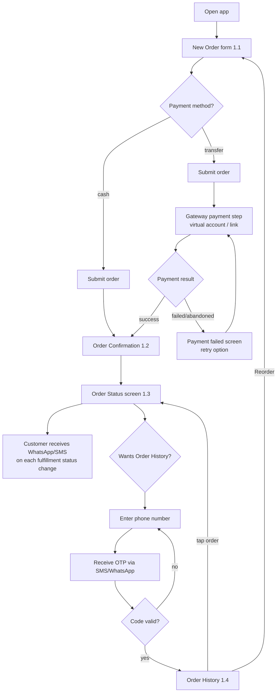
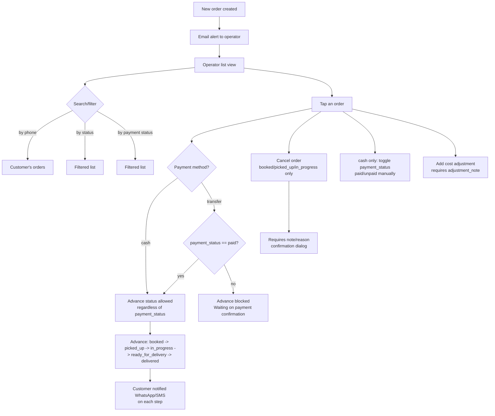
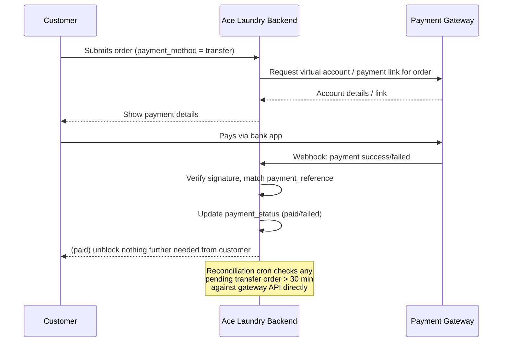
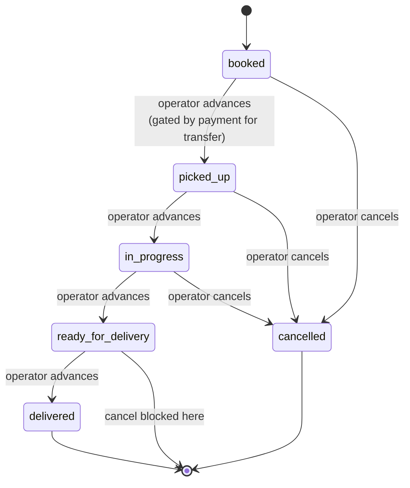

# Ace Laundry App — User Flow & App Flow

Diagrams below are in Mermaid syntax — render in any Mermaid-compatible viewer (GitHub, VS Code with the Mermaid extension, mermaid.live) for a visual version.

## 1. Customer flow — booking to delivery

## 2. Operator flow — order lifecycle management

## 3. Payment webhook flow (transfer orders)

## 4. Order state machine (combined fulfillment + payment)

Payment status runs alongside this as a separate field, gating only the `booked → picked_up` transition for `transfer` orders (see `01-product-plan.md` §2.3).

## 5. Notification touchpoints summary

| Trigger | Recipient | Channel | Timing |
|---|---|---|---|
| New order created | Operator | Email (v1), WhatsApp (fast-follow) | Immediate |
| Fulfillment status changes | Customer | WhatsApp if `whatsapp_ok`, else SMS | Immediate on each change |
| Transfer payment webhook: `paid` | System (badge update) | In-app only | Immediate |
| Transfer payment webhook: `failed` | Operator | Email or in-list flag | Immediate |
| Transfer order `pending` > 30 min | Operator | In-list flag | Via reconciliation cron |
| Order History access requested | Customer | SMS or WhatsApp (OTP code) | Immediate, on request |
