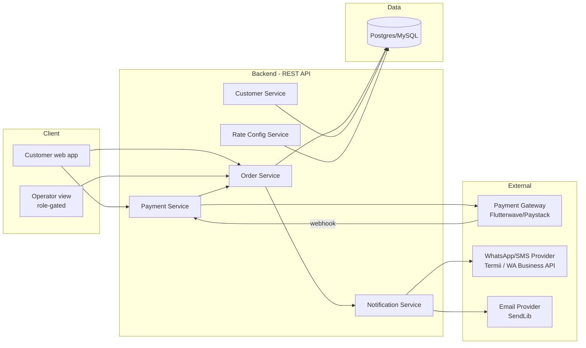

# Ace Laundry App — Backend Structure & Architecture

## 1. High-level architecture



Single backend service is sufficient at this scale — no justification for splitting into microservices. "Services" above are logical modules within one deployable app, not separate processes.

## 2. Module breakdown

### 2.1 Order Service
Owns the Order entity and all state transitions.
- `POST /orders` — create order. Computes `cost`, sets `rate_applied` from current Rate Config, sets `final_cost = cost` initially (no adjustment yet). If `payment_method = transfer`, kicks off Payment Service to request a virtual account/link before returning.
- `GET /orders/:id` — order detail (customer status screen + operator detail view).
- `GET /orders` — list with query params: `status`, `payment_status`, `phone`, `sort`. Operator-only, role-gated.
- `POST /orders/:id/cancel` — customer-initiated cancellation (docs/01 §1.3). Requires the order-history token (OTP-verified) whose phone claim matches the order's customer phone, plus a `note`. Cancellable only while `status = booked` — customers cannot cancel once picked up. Operator-only path unchanged.
- `PATCH /orders/:id/advance` — advance fulfillment status one step. **This is where the pickup gate lives** (see §3). Operator-only.
- `PATCH /orders/:id/cancel` — set status to `cancelled`, requires `note` in body. Validates current status is in `{booked, picked_up, in_progress}`. Operator-only.
- `PATCH /orders/:id/payment-status` — manual payment status toggle. Validates `payment_method = cash` only — reject if called on a `transfer` order (that field is webhook-owned for transfer). Operator-only.
- `PATCH /orders/:id/adjustment` — set `adjustment` + `adjustment_note` (note required if adjustment ≠ 0), recomputes `final_cost`. Operator-only.

### 2.2 Customer Service
Owns the Customer entity, keyed by phone number.
- On order creation: find-or-create customer by phone number (no separate registration step).
- `GET /customers/:phone/orders` — backs the phone-search feature in the operator list (operator-role-gated, no OTP needed there — the operator is already authenticated) **and** the customer's own order history, which is gated differently — see §2.6.

### 2.6 OTP Verification (customer-facing, order history + cancellation)
Lightweight, session-scoped — not a full account/auth system.
- `POST /otp/request` — body: `{ phone }`. Generates a short-lived code (e.g. 6 digits, 5–10 min expiry), sends via SMS/WhatsApp using the existing Notification Service provider. Rate-limit this endpoint (e.g. max 3 requests per phone per 15 min) to prevent abuse/spam-triggering costs on the SMS provider.
- `POST /otp/verify` — body: `{ phone, code }`. On match, issues a phone-scoped token valid ~7 days — not a general auth token, not reusable for booking or any other action.
- The token grants exactly two capabilities, both scoped to its phone claim (a token issued for one phone cannot touch another's):
  - `GET /customers/:phone/orders` (order history)
  - `POST /orders/:id/cancel` (customer cancellation — additionally requires the order's `status = booked`)
- No password, no persistent login ceremony — if the token expires, the customer just requests a fresh OTP. This keeps the system simple and matches the "no email, no password" identity model already established for booking.

### 2.3 Rate Config Service
- `GET /rate-config` — current rates, used by the booking form to compute live cost and by Order Service to stamp `rate_applied`.
- `PATCH /rate-config` — operator-only, updates the single-row settings table. No code deploy needed to change a price.

### 2.4 Payment Service
Isolates all gateway interaction so Order Service never talks to the gateway directly.
- `requestPayment(order)` — called on order creation for `transfer` orders. Requests a virtual account/link from the gateway, stores `payment_reference` on the order.
- `POST /webhooks/payment` — receives gateway callbacks. **Critical path, see §4.**
- **Reconciliation job** (cron, every 5–10 min): queries all `transfer` orders with `payment_status = pending` older than a threshold (e.g. 30 min), calls the gateway's transaction-status API directly for each, updates accordingly. This exists specifically because webhooks can be delayed or dropped — don't treat the webhook as the only source of truth.

### 2.5 Notification Service
Decoupled from Order Service via events, not direct calls — keeps notification failures from blocking order state changes.
- Listens for: `order.created` → email operator (v1) / WhatsApp operator (fast-follow).
- Listens for: `order.status_changed` → WhatsApp/SMS customer, channel chosen by `whatsapp_ok`.
- Listens for: `payment.failed` → flag/email operator.
- Each notification attempt should be logged (success/failure) so a silently-failed alert doesn't go unnoticed — a simple `notifications` log table is enough, no need for a full event-sourcing system.

## 3. The pickup gate — implementation detail

This is the one piece of business logic that must be enforced server-side, not just hidden in the UI (a client-side-only gate can be bypassed by anyone calling the API directly):

```
PATCH /orders/:id/advance

if current_status != 'booked' or target_status != 'picked_up':
    proceed with normal one-direction status advance

else (this is the booked -> picked_up transition specifically):
    if order.payment_method == 'cash':
        allow unconditionally
    if order.payment_method == 'transfer':
        if order.payment_status == 'paid':
            allow
        else:
            reject with 409 Conflict, reason: "payment_pending"
```

The operator UI reads this rejection reason and renders "Waiting on payment confirmation" instead of a raw error.

## 4. Webhook handler — required hardening

Given prior debugging experience with Flutterwave on other projects, this endpoint needs to be built defensively from the start, not patched after a bug shows up in production:

1. **Verify signature/secret** on every request against the raw payload — reject anything that doesn't match before touching the database.
2. **Idempotency:** the same webhook event can arrive more than once (gateway retries). Use the gateway's event/transaction ID to ensure a duplicate webhook doesn't double-process (e.g. re-trigger a "paid" state that's already set, harmless, but log it — vs. something non-idempotent like re-firing a notification).
3. **Match to order:** use `payment_reference` stored at order-creation time to find the correct order — never trust an amount-only or phone-only match.
4. **Respond fast, process after:** acknowledge the webhook (2xx) quickly, do heavier processing (notification dispatch, etc.) asynchronously if needed — slow webhook responses risk the gateway's timeout/retry behavior, and are worse on constrained hosting (Render free/starter tiers) where cold starts add latency.
5. **Log every webhook received**, verified or not — this is your debugging trail when a customer says "I paid but it still shows pending," and it's what the reconciliation job's manual fallback check depends on for comparison.

## 5. Environment & secrets

- Gateway API keys/webhook secrets, WhatsApp/SMS provider keys, email provider keys — all via environment variables, never committed. Given your Devalyze project history (an exposed API key incident), this is worth stating explicitly: rotate immediately if anything gateway- or payment-related ever lands in a commit or client-side bundle by mistake.
- Separate test/live gateway keys — test the full webhook + reconciliation flow against the gateway's sandbox before going live with real transfers.

## 6. Deployment

- Single backend deploy (Render/Railway/VPS per `03-technical-requirements.md` §9).
- Webhook endpoint must be a stable, publicly reachable HTTPS URL registered with the gateway dashboard — confirm this doesn't change across deploys/restarts (some platforms rotate URLs on certain plans; verify before launch).
- Cron/reconciliation job: use the hosting platform's scheduled job feature if available (Render Cron Jobs, Railway Cron), rather than an in-process `setInterval`, so it survives restarts and doesn't double-run across multiple instances if you ever scale beyond one.
